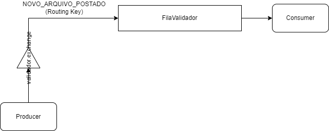

# Active Queue Manager Sample

> **_A simple project for learning about Spring Integration and it's flows when used in a RabbitMQ environment._**

## :page_facing_up: Overview

The project is built to integrate with a broker as follows:



A **producer** (created as project module) sends a message to a **consumer** (also a project module) through an intermediate
queue called *FilaValidador*. As simple as is, the queue is bound to the producer through and exchange, which gets
to know the target queue if the routing key *NOVO_ARQUIVO_POSTADO* is used in the process of sending the message.

### Technologies used:

- Spring Boot
- Spring Integration
- Docker
- RabbitMQ

## :dvd: Setup

To setup the project:

__1.__ Make sure you have [Maven](https://maven.apache.org/ "MAVEN") installed in your machine.

__2.__ Download this repository into a directory of your preference either by clicking on the *download* button in this repo or by cloning it using the [GIT CLI](https://git-scm.com/ "GIT CLI"):

```shell
$ git clone https://github.com/100f/active-queue-manager-sample.git
```
__3.__ Set up detached Docker container for the RabbitMQ Management Server by executing compose command in the `queue-server` folder (don't forget to have Docker in your machine and to have Docker daemon up and running):
```shell
$ docker-compose up -d
```
__4.__ Enter the RabbitMQ Management Server by accessing `localhost:15672` and logging with the username `admin`, password `1234` and do the following:

- Create a queue called *FilaValidador* with durable property set to true;
- Create an exchange called *validador.exchange* with durable property set to true;
- Enter in *validador.exchange* through server interface and add a binding to queue *FilaValidador* with *NOVO_ARQUIVO_POSTADO* as the routing key.

__5.__ Install the dependencies of *producer* and *consumer* projects (modules) by executing `mvn install` inside each one.

__6.__ Run the projects.

## :envelope: Sending a message

The producer runs at port 8088 and has `message/notificar` endpoint available.
Just send a *POST* request using the query param `rotulo` with a label for the message (it's appended in message headers)
and using a *JSON* body with `mensagem` field (message payload).

Example of request:

```shell
curl --request POST \
  --url 'http://localhost:8088/message/notificar?rotulo=TESTLABEL' \
  --header 'Content-Type: application/json' \
  --data '{
	"mensagem": "TEST MESSAGE PAYLOAD"
}'
```

Made by [Caio Enrique](http://github.com/100f) - Aug, 2022. :eyeglasses:


